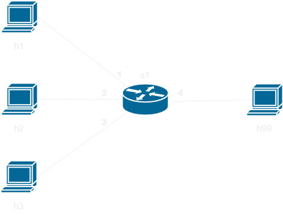

# Implementacja BPDU Guard oraz Root Guard

## Wstęp

Celem ćwiczenia jest napisanie programu w języku P4 symulującego zachowanie
mechanizmów BPDU Guard oraz Root Guard.

W ramach ćwiczenia użyta będzie topologia składająca się z jednego switcha (s1) z czterema hostami h1, h2, h3, h99 podłączonymi odpowiednio na portach 1, 2, 3, 4. Standardowo definicja topologi znajduje sie w pliku `pod-topo/topology.json`.



Program wgrywany na switch s1 znajduje się w pliku `s1.p4`. Rozwiązania znajdują się w folderze `solutions`. W katalogu głównym znajdują sie również dwa programy napisane w języku python, `listen.py` wypisuje na standardowe wyjście informacje o odebranych ramkach a `send.py` pozwala na wysłanie 3 rodzajów ramek po przez wpisanie odpowiedniego słowa na standardowe wejście:
* `hello` - zwykła ramka
* `nbpdu` - ramka bpdu nie powodująca zmiany korzenia
* `bbpdu` - ramka bpdu powodująca zmianę korzenia

Porty na których mają działać mechanizmy BPDU Guard lub root guard są wyróznone po przez wpisy w tablicy `guard_lookup`, wstępna pula wpisów znajduje się w pliku `s1-runtime.json`, 0 oznacza brak zabezpieczeń, 1 to BPDU guard a 2 to root guard.

## Testowanie rozwiązania

W celu kompilacji programu oraz wgraniu na wirtualne środowisko:
   ```bash
   make run
   ```
Zatrzymanie środowiska:
   ```bash
   make stop
   ```
Usunięci plików powstałych w czasie testowania
   ```bash
   make clean
   ```


## BPDU Guard
BPDU guard jest mechanizmem chroniącym przed zmianą drzewa rozpinającego po przez odfiltrowanie lub zablokowanie poru na którym wykryta zostanie ramka BPDU. BPDU guard powinien zostać włączony wyłącznie na portach do których mają zostać podłączone hosty.

### Implementcja w P4
W tym ćwiczeniu zaimplementowany zostanie wariant odfiltrowujący pakiety BPDU. W pliku `s1.p4` znajduje sie program który aktualnie wysyła wszystkie ramki do hosta 99. Prócz przekierowywania w pliku znajduje sie kod wykrywający(na podstawie adresu docelowego) i parsujący bramki BPDU wraz z definicją header'a uproszczonej bramki BPDU (na potrzeby ćwiczenia będziemy brać pod uwagę tylko identyfikator korzenia).

W celu implementcji:
1. Znajdź blok `MyIngress.apply` znajduje sie w nim komentarz TODO.
2. Napisz kod który po wykryciu bramki BPDU sprawdza czy na porcie zdefiniowany jest BPDU guard (hint: `meta.guard`), i w przypadku pozytywnym wywołuje akcje drop a następnie wychodzi z bloku (`return`). Aby sprawdzić czy aktualna ramka jest ramką BPDU możemy wywołać `hdr.bpdu.isValid()`.

### Sprawdzenie poprawności
Po kompilacji programu i wgraniu na wirtualne środowisko w programie mininet wpisujemy następującą komendę:
```bash
xterm h1 h2 h3 h99
```
uruchamia ona dla każdego wirtualnego hosta własny terminal. Następnie na hostach h1 h2 h3 uruchamiamy program  `./send.py`, a na host'cie h99 uruchamiamy `./listen.py`. Jak wspomina wcześniej program przed modyfikacją przesyłał wszystkie ramki do h99, po modyfikacji tylko ramki BPDU z h2, który podłączony jest do portu z BPDU gurd, nie powinny dochodzić do h99.
Najpierw wpiszmy `hello` do konsol h1 h2 h3, wszystkie wysłane ramki powinny być widoczne w konsoli h99, następnie wpiszmy `nbpdu` lub `bbpdu` do konsol h1 h2 h3, jeśli dobrze zaimplementowaliśmy BPDU guard to na konsoli h99 nie powinniśmy zobaczyć ramki z h2.


## Root guard
Root guard jest luźniejszą wersją BPDU guard, zamiast blokować wszystkie ramki blokowane są tylko ramki, które zmieniają korzeń drzewa rozpinającego.

### Implementacja
Implementacja wygląda praktycznie tak samo jak BPDU guard, dodany jest jedynie warunek, który sprawdza czy identyfikator korzenia jest lepszy (uproszczenie, w rzeczywistości porównuje się o wiele więcej rzeczy), czyli niższy. Identyfikator korzenia jest reprezentowany po przez stałą `ROOT_ID`.

### Sprawdzenie rozwiązania
Postępujemy tak samo jak w sprawdzaniu BPDU Guard, ale tym razem ramka wysłana za pomocą komedy `bbpdu` z hosta h3 powinna nie zostać przekazana do hosta h99.

## Relevant Documentation

The documentation for P4_16 and P4Runtime is available [here](https://p4.org/specs/)

excercise in this repository uses the v1model architecture, the documentation for which is available at:
1. The BMv2 Simple Switch target document accessible [here](https://github.com/p4lang/behavioral-model/blob/master/docs/simple_switch.md) talks mainly about the v1model architecture.
2. The include file `v1model.p4` has extensive comments and can be accessed [here](https://github.com/p4lang/p4c/blob/master/p4include/v1model.p4).